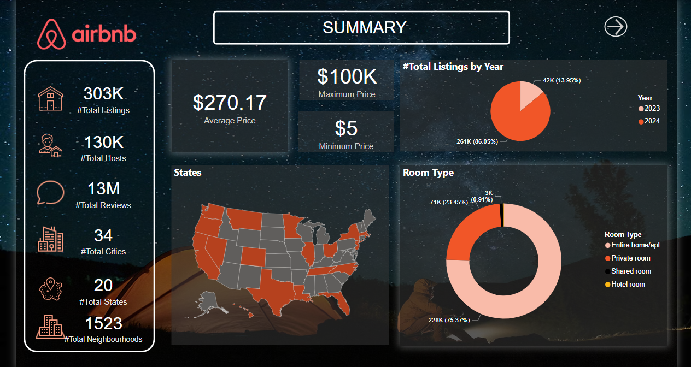
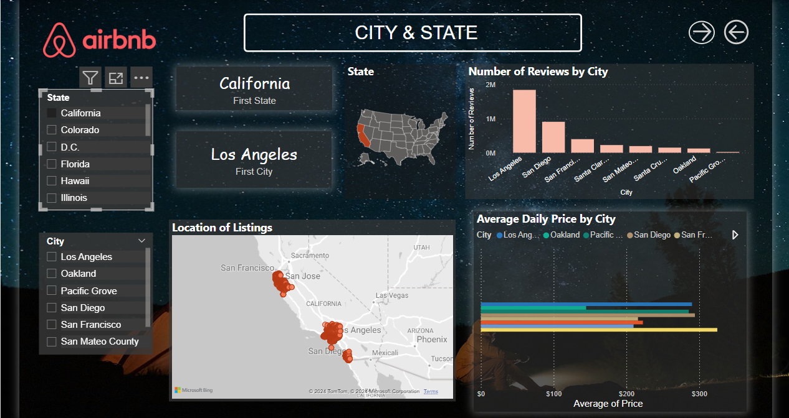
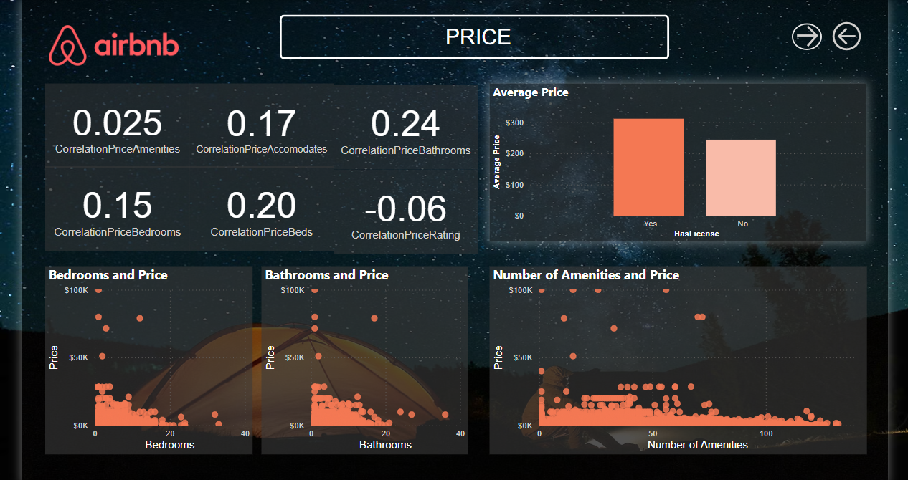

# AirBnB-USA-Analysis-and-Visualize-with-Power-BI

The project use data from https://insideairbnb.com/get-the-data/.
The result .pbix file is in the zipped file of the repo.

Note: The data is use data from the last few months of 2023 till May 2024. If you want to crawl and transform manually, data might have been updated differently from the data use in this project.

## Steps to crawl data and transform

### Run src/crawl_data.py
This module download all these files: listings.csv.gz, listings.csv, reviews.csv, neighbourhoods.csv of each city and state then create folder for each city and state to store the files. The listings.csv.gz files also get unzipped to listings_full.csv

### Run src/transformation.py
This merge all files of each city and state to single file: all_states_listings.csv, all_states_reviews.csv, all_states_neighbourhoods.csv

After creating the merged files, you can load to power bi to create a new project.

## Some Dashboard preview

### Summary

### City and State

### Price

